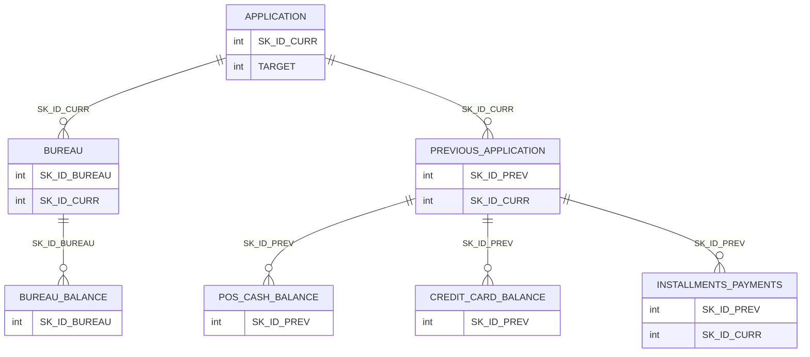
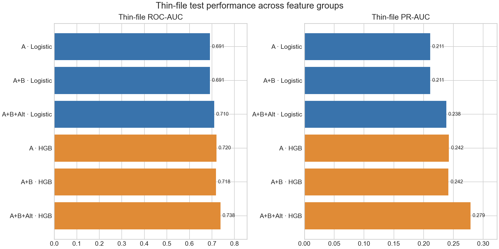
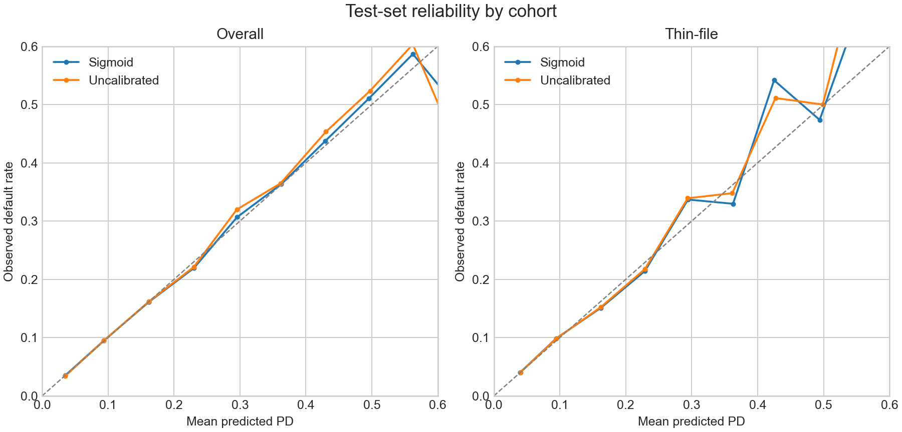
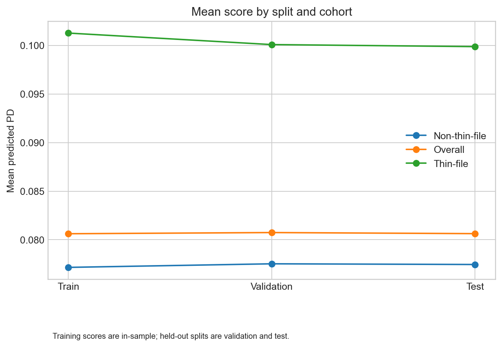

# Alternative Credit Scoring for Thin-File Borrowers

> Evaluating whether alternative behavioural history improves default-risk prediction when traditional bureau history is limited.

This project builds a borrower-level feature table from Home Credit application and historical account data, then compares three feature groups using Logistic Regression and HistGradientBoosting. The central question is whether previous application and installment-payment behaviour adds predictive signal for applicants with no bureau records.

> **Adding alternative behavioural history improved HGB ROC-AUC from 0.7490 to 0.7579 overall, and from 0.7179 to 0.7376 among thin-file borrowers.**


## Overview

The data is from the historical Home Credit Default Risk competition. It contains 307,511 applicants in the target-bearing `application_train.csv`. It is not current banking data, does not represent Ujjivan customers, and is not exclusively a thin-file population.

A **thin-file borrower** is defined here as an applicant with `BUREAU_CREDIT_COUNT == 0`: no bureau records at the application point. This definition was fixed before the main modelling analysis. It identifies 44,020 applicants. Many still have non-bureau history: 41,550 have previous-application records, 41,640 have installment history, and 41,780 have one or both.

The project tests whether those internal histories can supplement sparse bureau information. It does not assume that alternative behavioural history is universally better or that it should replace a bureau file.

## What the analysis found

- Bureau history added a modest improvement over application features in the controlled comparison.
- Alternative behavioural history added further predictive signal.
- The Model B to Model C gain was more pronounced among thin-file borrowers.
- HistGradientBoosting outperformed Logistic Regression in these comparisons.
- Application external scores were the strongest individual predictors; alternative behavioural features contributed additional signal.
- Calibration changes were modest and mixed.

These are ranking and prediction results on a historical holdout. They do not establish reduced NPAs, faster approvals, monetary savings, or equivalent results at another lender.

## Data architecture

The Home Credit data is relational. Current applications connect to bureau and prior applications; detailed bureau and account histories sit below those records. The diagram shows the dataset’s logical relationships. The shipped feature pipeline uses `application_train`, `bureau`, `previous_application`, and `installments_payments`; the other tables are shown for context and are not required to rebuild the current feature table.



`POS_CASH_balance`, `credit_card_balance`, and `installments_payments` also contain `SK_ID_CURR` in the source data. Their logical historical relationship is through `SK_ID_PREV`, which identifies the prior application.

| Table | Approx. rows | Grain and identifier | Relationship and role |
|---|---:|---|---|
| `application_train` | 307,511 | One current application; `SK_ID_CURR` | Target-bearing applicant population |
| `bureau` | 1,716,428 | One historical bureau record; `SK_ID_BUREAU` | Linked to current applicant by `SK_ID_CURR` |
| `bureau_balance` | 27,299,925 | Monthly status for a bureau record | Linked through `SK_ID_BUREAU` |
| `previous_application` | 1,670,214 | One historical application; `SK_ID_PREV` | Linked to current applicant by `SK_ID_CURR` |
| `POS_CASH_balance` | 10,001,358 | Historical POS/CASH balance record | Linked logically through `SK_ID_PREV` |
| `credit_card_balance` | 3,840,312 | Historical credit-card balance record | Linked logically through `SK_ID_PREV` |
| `installments_payments` | 13,605,401 | Historical installment/payment observation | Linked logically through `SK_ID_PREV` |

### SQL feature engineering

The feature pipeline uses SQL to aggregate historical records before joining them to the one-row-per-applicant application table. This keeps the model table at borrower grain and avoids multiplying application rows through joins to one-to-many histories.

```text
Many historical rows
        ↓
Aggregate by applicant or prior application
        ↓
Join applicant-level summaries to application
        ↓
One row per current application
        ↓
Model-ready feature table
```

The raw files are not stored in this repository. Obtain them separately from the Home Credit Default Risk competition and follow its access and use terms. Rebuilding the current feature table requires `application_train.csv`, `bureau.csv`, `previous_application.csv`, and `installments_payments.csv` in `data/raw/`.

## Feature groups

The controlled comparison adds feature groups in sequence:

```text
A  Application
   ↓ add bureau history
B  Application + Traditional Bureau
   ↓ add internal behavioural history
C  Application + Traditional Bureau + Alternative Behaviour
```

The models use the same frozen borrowers, split, and core preprocessing; the feature groups change across A, B, and C. Logistic Regression provides the controlled linear comparison. HistGradientBoosting checks whether the pattern holds with a nonlinear model.

| Feature group | Example features | Count |
|---|---|---:|
| Application | Income, credit amount, annuity, age, employment duration, external scores, credit/income and annuity/income ratios | 10 |
| Traditional bureau | Bureau credit and active counts, total credit and debt, debt ratio, average credit recency | 6 |
| Alternative behavioural | Prior application, approval and refusal counts; installment count, late count and ratio, underpayment count, missing-payment-information count | 8 |

Alternative behavioural features matter because an applicant may have little or no bureau history while still having previous applications or observed repayment behaviour with the lender represented in this dataset.

In particular, `PREV_APPROVED_COUNT` summarizes prior application outcomes, while `INST_LATE_PAYMENT_RATIO` measures observed installment lateness relative to installments with observed payment and scheduled dates. Both are among the stronger non-application predictors in the fitted model.

### Missing installment information

The source contains 2,905 installment rows where both `DAYS_ENTRY_PAYMENT` and `AMT_PAYMENT` are missing. The source does not specify what those missing values mean. The pipeline excludes these rows from observed late- and underpayment counts and represents them separately with `INST_PAYMENT_MISSING_COUNT`. It does not assume they were unpaid or successfully paid.

## Modelling and evaluation

The modelling population is split at borrower level into stratified train, validation, and test sets:

| Split | Applicants |
|---|---:|
| Train | 215,257 |
| Validation | 46,127 |
| Test | 46,127 |

This is a 70/15/15 split. The borrower IDs are frozen in `data/processed/splits/` and reused across phases. The repository commits those ID files, but not raw data or the processed feature table.

The analysis proceeds from controlled Logistic Regression feature-group ablation to a nonlinear HistGradientBoosting comparison. The selected HGB Model C uses validation-based model selection. A sigmoid calibration mapping is selected using validation data. Decision thresholds are also selected on validation. The historical test split is used for final reporting and predefined diagnostics; it had already been inspected during earlier benchmarking, so it is **not** an untouched confirmatory test.

### Leakage and evaluation controls

- `TARGET` is not included as a predictor, and `SK_ID_CURR` is not used as a predictor.
- Historical sources are aggregated to applicant level before modelling.
- Preprocessing is fitted using training data.
- Model selection, calibration, and threshold selection use validation data.
- Frozen borrower IDs are reused across the analysis phases.
- Test outcomes are reserved for final evaluation and predefined diagnostics; they do not select the model, calibrator, or thresholds.

## Results

### Overall final-holdout performance

| Feature group | Logistic ROC-AUC | Logistic PR-AUC | HGB ROC-AUC | HGB PR-AUC |
|---|---:|---:|---:|---:|
| Application | 0.7294 | 0.2086 | 0.7446 | 0.2302 |
| Application + Bureau | 0.7324 | 0.2122 | 0.7490 | 0.2385 |
| Application + Bureau + Alternative | **0.7414** | **0.2217** | **0.7579** | **0.2509** |



### Thin-file final-holdout performance

| Feature group | Logistic ROC-AUC | Logistic PR-AUC | HGB ROC-AUC | HGB PR-AUC |
|---|---:|---:|---:|---:|
| Application | 0.6910 | 0.2110 | 0.7202 | 0.2425 |
| Application + Bureau | 0.6910 | 0.2111 | 0.7179 | 0.2416 |
| Application + Bureau + Alternative | **0.7100** | **0.2380** | **0.7376** | **0.2787** |

For HGB, adding alternative behavioural history from Model B to Model C improved:

| Cohort | ROC-AUC gain | PR-AUC gain |
|---|---:|---:|
| Overall | +0.0089 | +0.0124 |
| Thin-file | +0.0197 | +0.0371 |

Paired bootstrap intervals for the Model C minus Model B gains:

| Cohort | ROC-AUC gain (95% CI) | PR-AUC gain (95% CI) |
|---|---:|---:|
| Overall | +0.0089 [0.0062, 0.0118] | +0.0124 [0.0075, 0.0174] |
| Thin-file | +0.0197 [0.0097, 0.0293] | +0.0371 [0.0168, 0.0550] |

These intervals quantify resampling uncertainty within this historical holdout. They do **not** establish out-of-time stability or generalization to another lender or time period.

## Calibration

The selected model is HGB Model C. Sigmoid calibration preserves its ranking metrics: ROC-AUC 0.757904 and PR-AUC 0.250944.

| Cohort | Metric | Raw | Sigmoid |
|---|---|---:|---:|
| Overall | Brier score | 0.067541 | 0.067537 |
| Overall | Log loss | 0.245562 | 0.245538 |
| Overall | 15-bin ECE | 0.002111 | 0.001263 |
| Thin-file | Brier score | 0.082692 | 0.082662 |
| Thin-file | Log loss | 0.291252 | 0.291187 |
| Thin-file | 15-bin ECE | 0.005440 | 0.006581 |

Calibration improvement is **modest and mixed rather than perfect**: thin-file Brier and log loss improve slightly, while thin-file ECE increases slightly.



## Illustrative decision analysis

At an illustrative 5:1 false-negative:false-positive normalized cost ratio, the overall threshold selected on validation is 0.15. On the final historical holdout, Model C has 86.03% approval, 41.78% default recall, 5.46% defaults among approved, and 0.3409 normalized cost per applicant.

At validation-selected cutoffs targeting approximately 70% approval, the thin-file comparison is:

| Model | Test approval | Default recall | Defaults among approved |
|---|---:|---:|---:|
| Model B: Application + Bureau | 69.39% | 59.03% | 5.96% |
| Model C: Application + Bureau + Alternative | 69.71% | 61.61% | 5.55% |

These are **illustrative** comparisons under assumed relative costs. They are not lending policy, bank economics, or production underwriting recommendations.


## What drives the model?

Validation permutation importance shows that application external scores are the strongest individual signals. Behavioural history also contributes incremental information.

| Feature | Validation average-precision decrease |
|---|---:|
| `APP_EXT_SOURCE_2` | 0.0637 |
| `APP_EXT_SOURCE_3` | 0.0541 |
| `APP_EXT_SOURCE_1` | 0.0278 |
| `APP_DAYS_BIRTH` | 0.0132 |
| `APP_DAYS_EMPLOYED` | 0.0114 |
| `PREV_APPROVED_COUNT` | 0.0095 |
| `INST_LATE_PAYMENT_RATIO` | 0.0089 |

`BUREAU_DEBT_RATIO` is an important bureau-side feature. Permutation importance measures model reliance, not causality.

Local explanation diagnostics use one-feature-at-a-time replacement with the training median. They are **not SHAP values** and are not automatically suitable as regulatory adverse-action reasons.


## Stability and responsible checks

Paired bootstrap intervals for Model C minus Model B were positive in the overall, thin-file, and non-thin-file cohorts. Train-decile PSI values for selected features were below 0.0003 on validation and test, and the score summaries were broadly similar across the random splits. Performance varies across cohorts, and small slices have uncertain estimates.

These checks do not establish fairness certification, legal sufficiency, out-of-time performance, causal effects, or production readiness.



## Reproduce the analysis

Use Python 3.10 or later and install the dependencies from `requirements.txt`. Place the required raw CSVs in `data/raw/`. From the repository root, run:

```bash
python -m pip install -r requirements.txt
python -m src.features
python -m src.nonlinear
python -m src.phase10
python -m src.phase11
python -m src.phase12
python -m src.phase13
python -m src.release
python -m pytest -q
```

`src.features` builds the local SQLite database and borrower-level feature table. The phase modules run the model comparison, calibration, decision, explanation, and stability analyses. `src.release` assembles the curated tables and figures under `reports/final/`. The final test suite passed: **26 passed**. Results may vary in runtime or bit-level detail across machines and environments.

## Repository structure

```text
.
├── data/
│   ├── raw/                 # Local source files; not committed
│   ├── interim/             # Local SQLite database; not committed
│   ├── processed/           # Local feature table; not committed
│   │   └── splits/          # Frozen borrower IDs and split notes
│   └── README.md
├── docs/
│   ├── final_results.md
│   ├── reproducibility.md
│   ├── interview_summary.md
│   ├── resume_results.md
│   ├── phase8_ablation.md
│   ├── feature_specification.md
│   ├── feature_validation.md
│   ├── data_dictionary_notes.md
│   └── leakage_audit.md
├── reports/
│   ├── final/               # Curated figures and summary tables
│   └── tables/              # Phase-level metrics and audit records
├── sql/
│   ├── schema.sql
│   ├── feature_queries.sql
│   ├── data_quality.sql
│   └── analytical_queries.sql
├── src/                     # Feature build, modelling, analysis, reporting
├── tests/
├── environment.yml
├── requirements.txt
├── LICENSE
└── README.md
```

## Limitations

- The dataset is historical and comes from one competition setting; it is not current banking data or a Ujjivan customer sample.
- Evaluation uses a random holdout, not out-of-time validation. The test split was inspected during earlier benchmarking, and there is no independent external validation.
- Bootstrap intervals quantify resampling uncertainty within this holdout; they do not show performance across time or institutions.
- No fairness certification, causal effect, applicant utility analysis, legal/adverse-action validation, or production monitoring is established.
- Decision costs are illustrative and are not based on real lending economics.
- Missing installment-payment semantics are uncertain in the source data; the analysis represents this uncertainty rather than inventing an outcome.
- This project does not demonstrate production underwriting readiness.

## Why this project is useful in an interview

The project provides concrete examples of relational SQL thinking, borrower-level feature engineering, credit-risk modelling, controlled experimentation, validation discipline, class-imbalance-aware evaluation, calibration, threshold analysis, explainability, reproducibility, and responsible interpretation.

## Conclusion

The analysis provides evidence that alternative behavioural history contains incremental predictive information beyond application and bureau features, with the strongest improvement observed among borrowers with no bureau records. The result is consistent across the controlled Logistic Regression ablation and nonlinear HGB comparison. It comes from a historical random holdout and does not establish out-of-time, cross-institution, fairness, or production performance.

**Project documents:** [Final results](docs/final_results.md) · [Reproducibility](docs/reproducibility.md) · [Interview summary](docs/interview_summary.md) · [Resume results](docs/resume_results.md)
