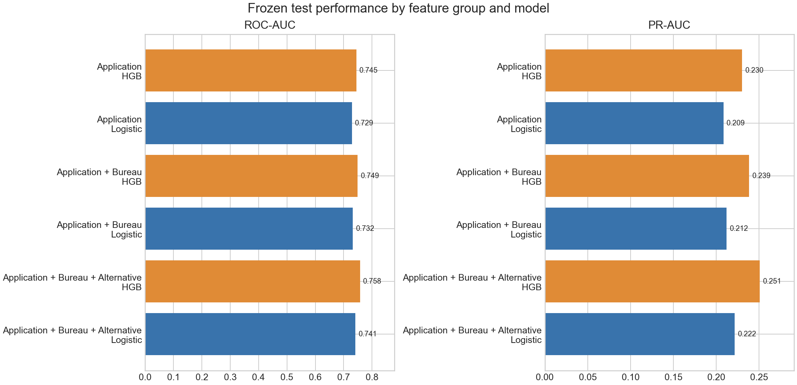
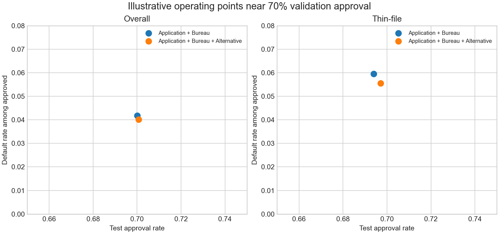
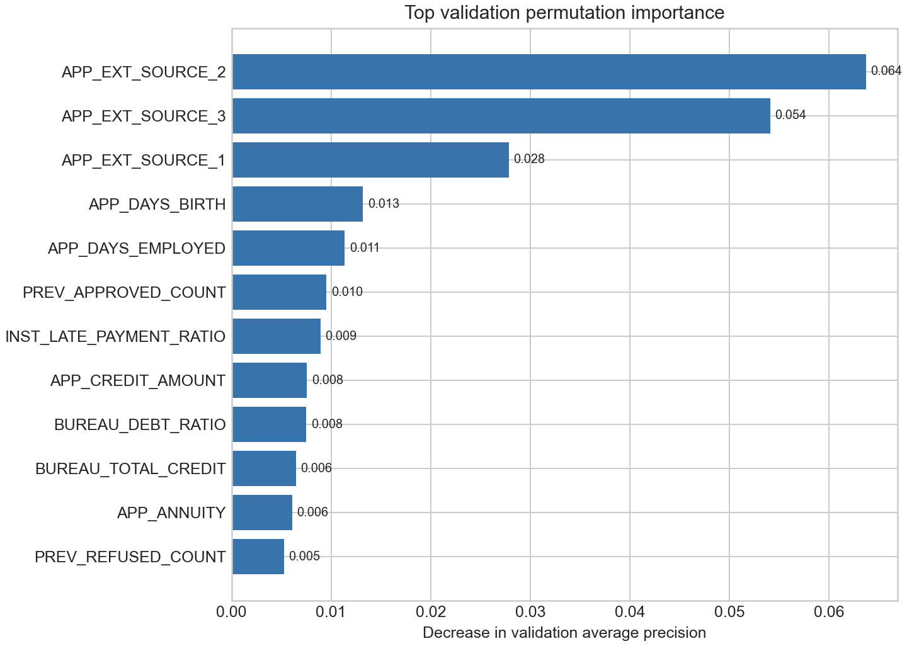

# Results

## Evaluation population

The results use a fixed stratified 70/15/15 borrower split: 215,257 training, 46,127 validation, and 46,127 test borrowers. Thin-file means BUREAU_CREDIT_COUNT equals zero. There are 44,020 thin-file applicants in the full population and 6,534 in the test cohort.

The test split had been inspected during earlier benchmarking. Results are therefore a final historical holdout evaluation, not an untouched confirmatory test.

Model A uses application information, Model B adds traditional bureau features, and Model C adds alternative behavioural history. The same borrower IDs and core preprocessing are used across the controlled Logistic Regression comparison. HistGradientBoosting (HGB) checks whether the pattern holds with a nonlinear model.

## Overall and thin-file ranking performance

| Feature group | Logistic overall ROC-AUC / PR-AUC | HGB overall ROC-AUC / PR-AUC | Logistic thin-file ROC-AUC / PR-AUC | HGB thin-file ROC-AUC / PR-AUC |
|---|---:|---:|---:|---:|
| Application | 0.7294 / 0.2086 | 0.7446 / 0.2302 | 0.6910 / 0.2110 | 0.7202 / 0.2425 |
| Application + Bureau | 0.7324 / 0.2122 | 0.7490 / 0.2385 | 0.6910 / 0.2111 | 0.7179 / 0.2416 |
| Application + Bureau + Alternative | 0.7414 / 0.2217 | 0.7579 / 0.2509 | 0.7100 / 0.2380 | 0.7376 / 0.2787 |

For HGB, adding alternative behavioural history (Model B to Model C) improved overall ROC-AUC by 0.0089 and PR-AUC by 0.0124. Among thin-file borrowers, the gains were 0.0197 and 0.0371.

## Paired bootstrap uncertainty

The paired, outcome-stratified bootstrap uses 500 resamples of fixed holdout predictions.

| Cohort | ROC-AUC gain (95% interval) | PR-AUC gain (95% interval) |
|---|---:|---:|
| Overall | +0.0089 [0.0062, 0.0118] | +0.0124 [0.0075, 0.0174] |
| Thin-file | +0.0197 [0.0097, 0.0293] | +0.0371 [0.0168, 0.0550] |

The intervals quantify resampling uncertainty within this historical holdout. They do not establish performance over time or generalization to another institution.

## Probability calibration

The selected model is HGB Model C. Its uncalibrated and sigmoid-calibrated test ranking metrics are identical: ROC-AUC 0.757904 and PR-AUC 0.250944.

| Cohort | Measure | Raw | Sigmoid |
|---|---|---:|---:|
| Overall | Brier score | 0.067541 | 0.067537 |
| Overall | Log loss | 0.245562 | 0.245538 |
| Overall | 15-bin ECE | 0.002111 | 0.001263 |
| Thin-file | Brier score | 0.082692 | 0.082662 |
| Thin-file | Log loss | 0.291252 | 0.291187 |
| Thin-file | 15-bin ECE | 0.005440 | 0.006581 |

Calibration improvement is modest and mixed rather than perfect: thin-file Brier score and log loss improve slightly, while thin-file ECE increases slightly.

## Illustrative decision analysis

Under an illustrative false-negative:false-positive cost ratio of 5:1, validation selects an overall threshold of 0.15. On the historical holdout, Model C has 86.03% approval, 41.78% default recall, 5.46% defaults among approved, and 0.3409 normalized cost per applicant. Model B at the same cutoff has 86.26% approval, 41.27% default recall, 5.50% defaults among approved, and 0.3411 normalized cost.

At cutoffs selected on validation to target approximately 70% approval, thin-file holdout results are:

| Model | Approval | Default recall | Defaults among approved |
|---|---:|---:|---:|
| Application + Bureau | 69.39% | 59.03% | 5.96% |
| Application + Bureau + Alternative | 69.71% | 61.61% | 5.55% |

These comparisons use assumed normalized costs. They are not lending policy, bank economics, or production underwriting recommendations.

## Model reliance and stability

Validation permutation importance is led by the application external scores. Previous approvals and installment late-payment ratio also contribute:

| Feature | Average-precision decrease |
|---|---:|
| APP_EXT_SOURCE_2 | 0.0637 |
| APP_EXT_SOURCE_3 | 0.0541 |
| APP_EXT_SOURCE_1 | 0.0278 |
| APP_DAYS_BIRTH | 0.0132 |
| APP_DAYS_EMPLOYED | 0.0114 |
| PREV_APPROVED_COUNT | 0.0095 |
| INST_LATE_PAYMENT_RATIO | 0.0089 |

BUREAU_DEBT_RATIO is an important bureau-side feature. Permutation importance measures fitted-model reliance, not causality. Local diagnostics use one-feature-at-a-time replacement with the training median; they are not SHAP values and are not automatically suitable as regulatory adverse-action reasons.

Train-decile PSI for selected features was below 0.0003 on validation and test. Performance varies across cohorts, and estimates for small groups are uncertain.

## Limitations

- The data is historical and comes from one competition setting; it is not current banking data.
- Evaluation uses a random holdout, not out-of-time validation. The holdout had been inspected during earlier benchmarking.
- Bootstrap intervals quantify uncertainty within this holdout only.
- No external validation, fairness certification, causal effect, applicant-utility analysis, legal review, or production monitoring is established.
- Decision costs are illustrative, not real lending economics.
- The source does not specify the meaning of some missing installment-payment records; the feature design preserves that uncertainty.

The comparison provides evidence of incremental predictive signal in this dataset. It does not establish that the model is suitable for deployment.
